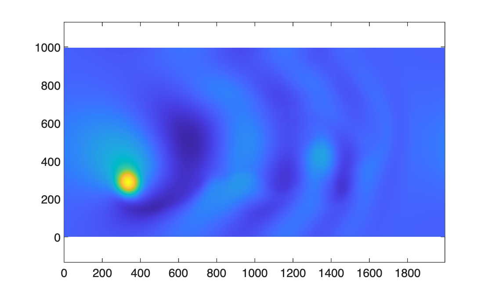

# Modeling with satellite observations

This tutorial uses the WaveVortexModel to model the evolution of a mesoscale eddy. The AlongTrackSimulator samples the sea\-surface of the model in the sampling pattern of the current altimetry missions.

## Model initialization

Set up the model domain

```matlab
Lx = 2000e3;
Ly = 1000e3;

Nx = 2*256;
Ny = 2*128;

latitude = 24;

wvt = WVTransformBarotropicQG([Lx, Ly], [Nx, Ny], h=0.8, latitude=latitude);
```
## Add a gaussian eddy
```matlab
x0 = 3*Lx/4;
y0 = Ly/2;
A = 0.15;
L = 80e3;
wvt.setSSH(@(x,y) A*exp( - ((x-x0).^2 + (y-y0).^2)/L^2),shouldRemoveMeanPressure=1 );

figure, pcolor(wvt.x/1e3,wvt.y/1e3,wvt.ssh.'), shading interp, axis equal
```


## Add small scale damping, beta\-plane advection, and initialize the model
```matlab
wvt.addForcing(WVAdaptiveDamping(wvt));
wvt.addForcing(WVBetaPlanePVAdvection(wvt));
model = WVModel(wvt);
```
## Use the simulator to add all current altimetry missions
```matlab
outputFile = model.createNetCDFFileForModelOutput('QGMonopoleWithAlongTrack.nc',outputInterval=86400,shouldOverwriteExisting=1);
model.addNetCDFOutputVariables("ssh","zeta_z")
ats = AlongTrackSimulator();
currentMissions = ats.currentMissions;
for iMission = 1:length(currentMissions)
    outputFile.addOutputGroup(WVModelOutputGroupAlongTrack(model,currentMissions(iMission),ats));
end
```
## Run the model for one year
```matlab
model.integrateToTime(365*86400);

figure, pcolor(wvt.x/1e3,wvt.y/1e3,wvt.ssh.'), shading interp, axis equal
```


