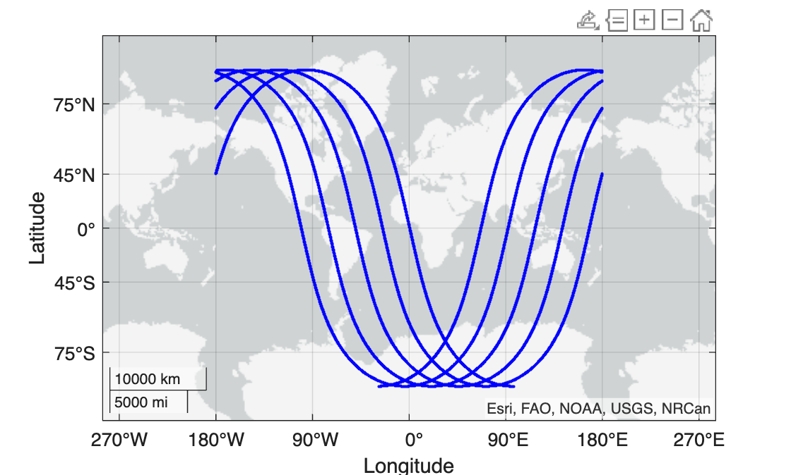

# Getting Started

This tutorial demonstrates the basic usage of the simulator.

# Initialization

You always start by initializing the simulator.

```matlab
ats = AlongTrackSimulator();
```

The simulator has a list satellite altimetry missions, found by calling `ats.missions()`, of which there are 8 operatoring as of this writing,

```matlab
ats.currentMissions()
```

```matlabTextOutput
ans = 8x1 string array

"alg"   
"c2n"   
"h2b"   
"j3n"   
"s3a"   
"s3b"   
"s6a"   
"swon"  

```


The mission codes correspond to entries in the `missionParameters` dictionary, which can be accessed directly, or quickly summarized,

```matlab
ats.summarizeMissionWithName(ats.currentMissions)
```

```
                       Name                       Abbreviation            Start              End     RepeatCycle
    __________________________________________    ____________    ______________________    _____    ___________

    "Saral/AltiKa drifting (geodetic) orbit"         "alg"        "31-Mar-2015 22:53:34"    "Inf"     "Inf"     
    "Cryosat-2 new orbit"                            "c2n"        "01-Aug-2020 10:56:11"    "Inf"     "Inf"     
    "HaiYang-2B 14-day cycle"                        "h2b"        "20-Dec-2019 21:44:06"    "Inf"     "13.9998" 
    "Jason-3 Interleaved Orbit"                      "j3n"        "28-Feb-2021 23:14:50"    "Inf"     "9.9156"  
    "Sentinel-3A"                                    "s3a"        "01-Mar-2016 14:39:51"    "Inf"     "27.0001" 
    "Sentinel-3B"                                    "s3b"        "26-Nov-2018 23:42:07"    "Inf"     "27.0001" 
    "Sentinel-6 Michael Freilich 10-day cycle"       "s6a"        "09-Feb-2022 23:13:23"    "Inf"     "9.9156"  
    "SWOT 21-day cycle"                              "swon"       "21-Jul-2023"             "Inf"     "20.8646" 
```

# Ground tracks

You can now query for the ground tracks for any given mission using `groundTrackForMissionWithName`. You can request specific times, or just a certain number of orbits from the start date,

```matlab
[lat,lon,time] = ats.groundTrackForMissionWithName("s3a",N_orbits=5);
figure, geoscatter(lat,lon,1.5^2,"blue","filled")
```



Some missions have exact repeat orbits, e.g. the 27 day repeat cycle of Sentinal\-3A, and thus it is convenient to fetch one complete cycle. You can use  `[lat,lon,time] = repeatGroundTrackForMissionWithName(mission)` to do this for any of the missions with repeat cycle.

