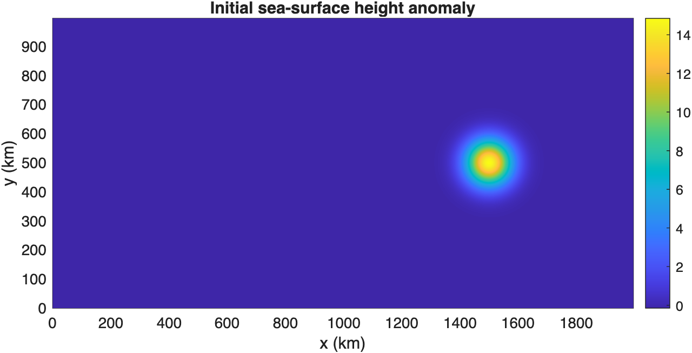
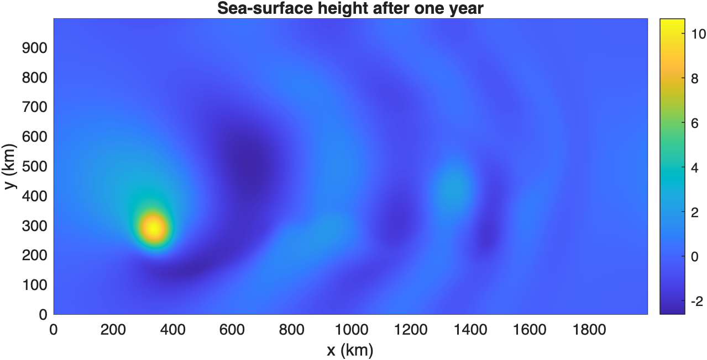

# Modeling with satellite observations

Model a mesoscale eddy with WaveVortexModel and compare how current altimetry missions sample it.

Source: `Examples/Tutorials/Modeling.m`

## Initialize the model domain

We start with a barotropic quasi-geostrophic domain large enough to watch
one mesoscale eddy translate across the basin while the active missions
sample it along their native ground tracks.

```matlab
Lx = 2000e3;
Ly = 1000e3;
Nx = 2*256;
Ny = 2*128;
latitude = 24;

wvt = WVTransformBarotropicQG([Lx, Ly], [Nx, Ny], h=0.8, latitude=latitude);
```

## Add a Gaussian eddy

The initial sea-surface height anomaly is

$$
\eta(x,y)=A\exp\left(-\frac{(x-x_0)^2 + (y-y_0)^2}{L^2}\right),
$$

so the tutorial begins from one isolated anticyclonic feature.

```matlab
x0 = 3*Lx/4;
y0 = Ly/2;
A = 0.15;
L = 80e3;
wvt.setSSH(@(x, y) A*exp(-((x-x0).^2 + (y-y0).^2)/L^2), shouldRemoveMeanPressure=true);

figure(Position=[100 100 760 320])
pcolor(wvt.x/1e3, wvt.y/1e3, 100*(wvt.ssh).'), shading interp
axis equal tight
xlabel("x (km)")
ylabel("y (km)")
title("Initial sea-surface height anomaly")
colorbar
```



*The Gaussian eddy starts as one compact sea-surface height anomaly centered away from the boundaries.*

## Add the background dynamics

We add adaptive damping and beta-plane advection before launching the
model integration.

```matlab
wvt.addForcing(WVAdaptiveDamping(wvt));
wvt.addForcing(WVBetaPlanePVAdvection(wvt));
model = WVModel(wvt);
```

## Add the active altimetry missions

The along-track output group samples the model with the geometry of each
currently operating mission.

```matlab
netcdfPath = string(tempname) + ".nc";
cleanupNetCDF = onCleanup(@() deleteTemporaryFile(netcdfPath)); %#ok<NASGU>
outputFile = model.createNetCDFFileForModelOutput(netcdfPath, outputInterval=86400, shouldOverwriteExisting=true);
model.addNetCDFOutputVariables("ssh", "zeta_z");

ats = AlongTrackSimulator();
currentMissions = ats.currentMissions;
for iMission = 1:length(currentMissions)
    outputFile.addOutputGroup(WVModelOutputGroupAlongTrack(model, currentMissions(iMission), ats));
end
```

## Integrate for one year

This gives the eddy time to translate westward while the repeat and
drifting missions build up different spatial sampling patterns.

```matlab
model.integrateToTime(365*86400);
outputFile.closeNetCDFFile();

figure(Position=[100 100 760 320])
pcolor(wvt.x/1e3, wvt.y/1e3, 100*(wvt.ssh).'), shading interp
axis equal tight
xlabel("x (km)")
ylabel("y (km)")
title("Sea-surface height after one year")
colorbar
```



*After one year the eddy has propagated westward and broadened under the model dynamics.*

## Render the satellite sampling movie

The movie combines the full field with three observation views: the
reference mission, the reference-plus-interleaved pair, and all active
missions together.

```matlab
movieSettings = modelingMovieSettings(currentMissions);
```

<video
  controls
  preload="metadata"
  poster="./modeling-with-satellite-observations/t-001.png"
  style="max-width: 100%; height: auto;">
  <source src="./modeling-with-satellite-observations/QGMonopoleSatelliteObservations.mp4" type="video/mp4">
  Your browser does not support the HTML5 video tag.
</video>

*Daily snapshots of the full field are shown with the reference mission, the reference-plus-interleaved pair, and all active missions using a four-day fading window around each frame.*

The upper-left panel shows the full model field.

The upper-right panel shows the reference mission, Sentinel-6A, with a
four-day fade before and after each frame so the repeat-track pattern is
visible.

The lower-left panel adds the interleaved Jason-3 orbit to show how the
staggered pair fills gaps between successive Sentinel-6A passes.

The lower-right panel overlays all active missions to show how the full
constellation samples the eddy.

